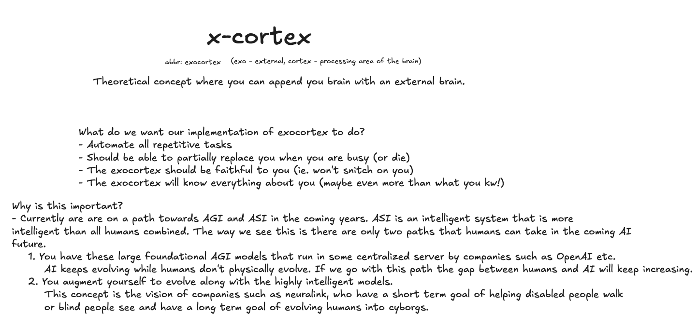

  

<!-- 
In an increasingly digital world, people often find themselves overwhelmed by repetitive tasks—whether it’s managing schedules, responding to messages, or handling calls. Current virtual assistants, while useful, typically lack the personalization and privacy that modern users demand. 

## Areas of Exploration
Our research focuses on three pivotal areas aimed at revolutionizing the functionality of AI assistants:

### 1. LLM Optimization
The first step is optimizing large language models (LLMs) to ensure they can run effectively on individual devices without compromising performance. 

- **Use Cases**: Automating everyday tasks such as texting, scheduling, and call management with tailored responses.
- **Challenges**: Achieving the right balance between personalized outputs and the computational resources available on user devices (CPU, RAM).

**Goal**: Reduce the size and complexity of LLMs while maintaining responsiveness and accuracy, allowing for a seamless user experience.

### 2. Localized Processing and Data Privacy
Moving beyond cloud dependency is crucial. By processing data locally, we enhance user privacy and security, ensuring sensitive information remains on the user’s device.

- **Use Cases**: Safeguarding personal data during communications and ensuring secure task management.
- **Challenges**: Developing high-performance models capable of functioning efficiently on local devices without lag.

**Goal**: Achieve complete data privacy by ensuring all information is processed locally, thus mitigating the risks associated with cloud storage and data breaches.

### 3. Personalized Responses through Data Utilization
Harnessing personal data—such as communication patterns and user preferences—allows the digital assistant to provide hyper-personalized interactions.

- **Examples of Data**:
    - **Texts**: Analyzing communication history for natural language processing.
    - **Calls**: Understanding frequent contacts and preferred handling methods.
    - **Calendar**: Customizing scheduling based on individual routines.

- **What can this data be used for?**:
    - Generating automated responses that align with the user’s voice and communication style.
    - Creating a personal assistant that adapts to daily schedules and offers tailored recommendations.

**Goal**: Utilize personal data to foster an adaptive AI that responds uniquely to each user, enhancing the overall experience while prioritizing privacy.

## Conclusion
The future of digital assistants lies in delivering **personalized**, **efficient**, and **secure** AI-powered solutions that adapt to individual user needs. By focusing on optimization, localized processing, and data utilization, we aim to set a new standard for intelligent assistants—making them not only smarter and faster but also more attuned to the values of privacy and personalization. -->
