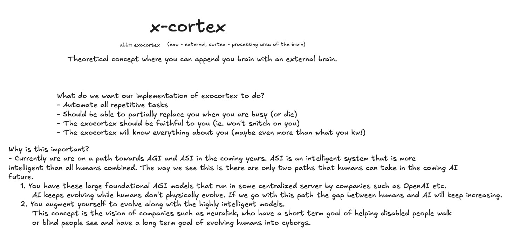

<!--    -->

```
abbr: exocortex (exo - external, cortex - brain)
```

Theoretical concept where you can append your brain with an external brain.

### What do we want our exocortex to do?

- Automate all repetitive tasks
- Be able to partially replace you when you are busy
- Be faithful to you 
- Know everything about you

### Why is this important?

Currently, we are on a path towards AGI and ASI in the coming years. ASI is an intelligent system that is more intelligent than all humans combined. The way we see this is that there are only two paths that humans can take in the coming AI future:

1. You have large foundational AGI models that run on centralized servers by companies such as OpenAI. AI keeps evolving while humans don't physically evolve. If we go with this path, the gap between humans and AI will keep increasing.
2. You augment yourself to evolve along with the highly intelligent models. This concept is the vision of companies such as Neuralink, which have a short-term goal of helping disabled people walk or blind people see, and a long-term goal of evolving humans into cyborgs.
