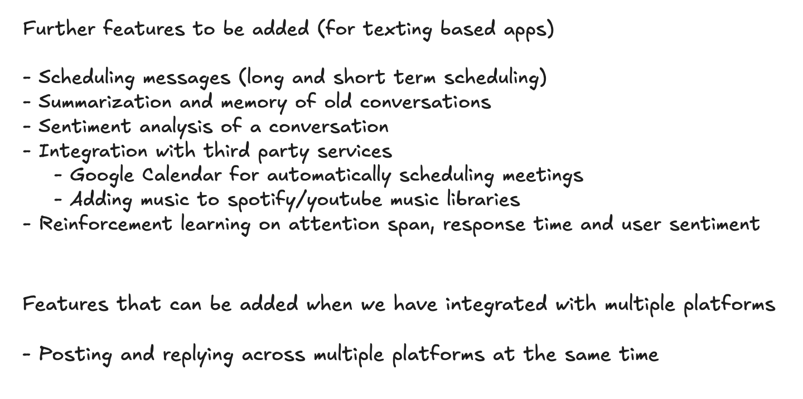

<!--  -->

### For our texting-based apps

**Scheduling Messages**

- Long-term and short-term scheduling options.

**Summarization and Memory**

- Ability to summarize and retain memory of old conversations.

**Sentiment Analysis**

- Analyze the sentiment of conversations.

**Integration with Third-Party Services**

- **Google Calendar**: Automatically schedule meetings.
- **Music Libraries**: Add music to Spotify and YouTube Music libraries.

**Reinforcement Learning**

- Improve attention span, response time, and user sentiment through reinforcement learning.

### Integration with multiple platforms

**Multi-Platform Interaction**

- Posting and replying across multiple platforms at the same time

**User Adaptation**

- Adapting to users' preferences and behaviors over multiple platforms
