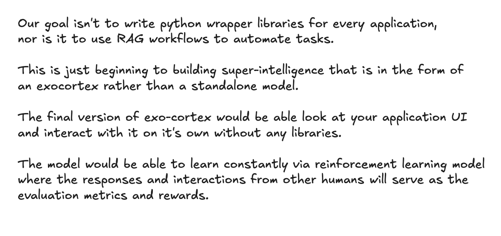

<!--  -->

Our goal isn't to write python wrapper libraries for every application,
nor is it to use RAG workflows to automate tasks.

This is just beginning to building super-intelligence that is in the form of
an exocortex rather than a standalone model.

The final version of exo-cortex would be able look at your application UI
and interact with it on it's own without any libraries.

The model would be able to learn constantly via reinforcement learning model
where the responses and interactions from other humans will serve as the
evaluation metrics and rewards.
