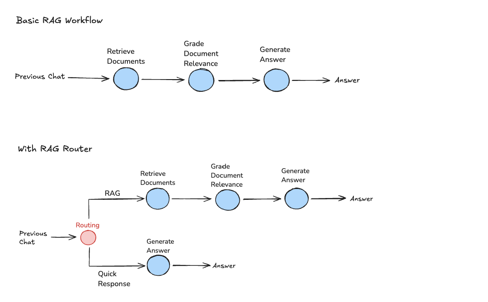
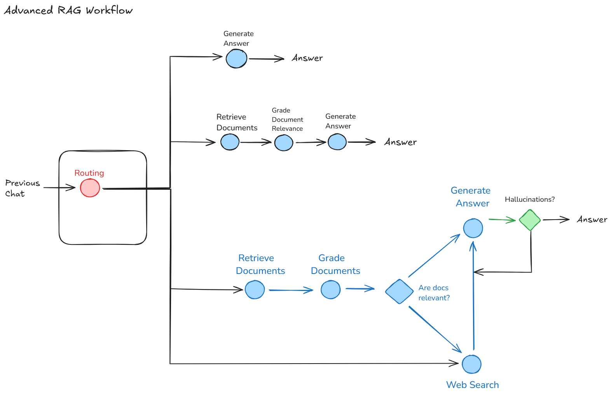

The Retrieval-Augmented Generation (RAG) workflow integrates retrieval mechanisms with generative models, allowing for more informed and contextually relevant outputs. This section explores the workflows implemented in LangChain and LangGraph.

  
  

## Three types of RAG

- **Routing:** Adaptive RAG ([paper](https://arxiv.org/abs/2403.14403)). Route questions to different retrieval approaches
- **Fallback:** Corrective RAG ([paper](https://arxiv.org/pdf/2401.15884.pdf)). Fallback to web search if docs are not relevant to query
- **Self-correction:** Self-RAG ([paper](https://arxiv.org/abs/2310.11511)). Eg. fix hallucinations
