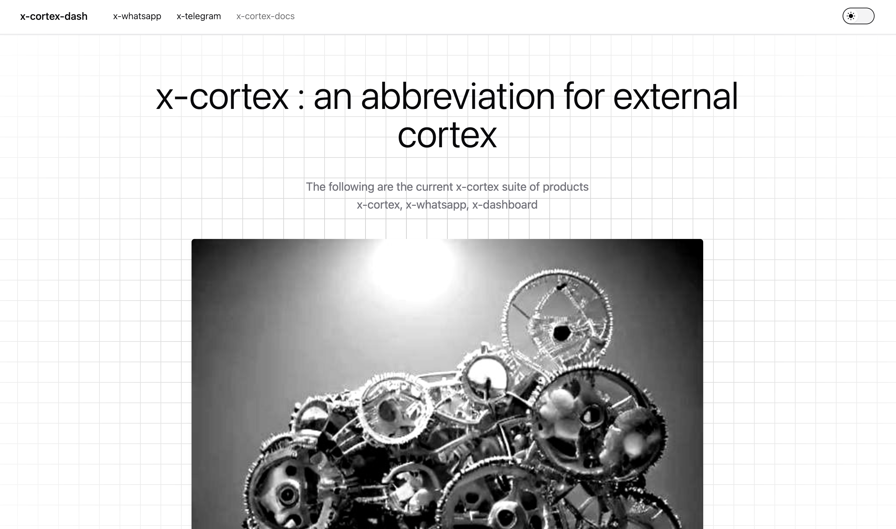

We want our product to be very user friendly and simple to use. We also believe in clean and minimal design. Hence we go with the ShadCN Design theme. Our UI is responsive and works well on both desktop and mobile devices.   

<!-- 
Below are the key principles guiding our design process:

### 1. **User-Centric Design:**
   - Prioritize user needs and preferences in the design process.
   - Conduct user research and testing to understand pain points and requirements.

### 2. **Intuitive Interface:**
   - Develop a clean and simple interface that allows easy navigation and interaction.
   - Use familiar design patterns to minimize the learning curve for new users.

### 3. **Personalization Features:**
   - Implement customization options allowing users to tailor the assistant’s responses and behavior to their preferences.
   - Provide feedback mechanisms for users to rate the quality of responses and improve future interactions.

### 4. **Accessibility:**
   - Ensure the assistant is accessible to all users, including those with disabilities.
   - Implement features like voice commands and screen reader compatibility.

### 5. **Feedback and Improvement:**
   - Incorporate user feedback continuously to enhance the assistant's capabilities.
   - Regularly update the UI based on user interactions and preferences. 
--->
