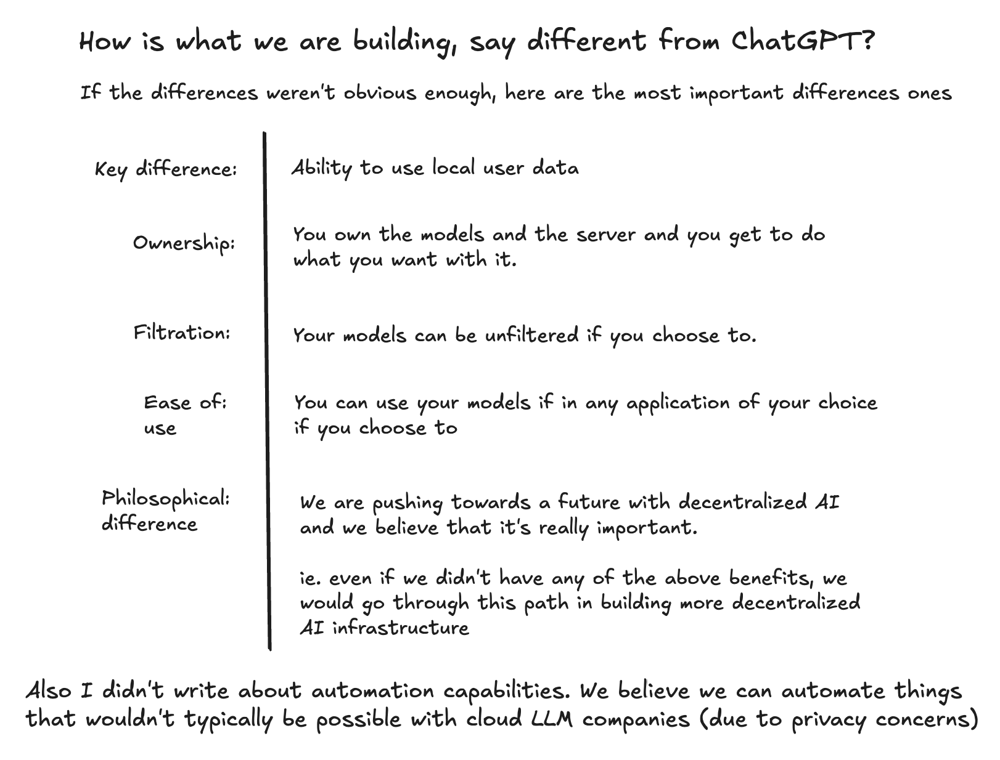

<!--  -->

If the differences weren't obvious enough, here are the most important differences:

| Feature        | x-cortex                                                                   |
| -------------- | -------------------------------------------------------------------------- |
| Key Difference | Ability to use local user data                                             |
| Ownership:     | You own the models and the server and you get to do what you want with it. |
| Filtration:    | Your models can be unfiltered if you choose to.                            |
| Ease of use:   | You can use your models if in any application of your choice.              |

## Philosophical Difference

This is the most important difference. Even if we did not have any of the above mentioned benefits over the traditional centralized AI infrastructure, we would still go through this path.

We are pushing towards a future with decentralized AI and we believe that it's really important.
